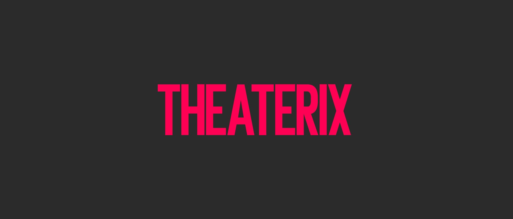

<p align="center">
  <a href="https://www.theaterix.com">
    
  </a>
</p>
<p align="center">
  Stories so big they can not fit on the big screen
</p>
<p align="center">
  <a href="https://www.theaterix.com">www.theaterix.com</a>
</p>

---

<div align="center">

  []() 
  [](https://github.com/theaterixcom/theaterixcom.github.io/issues)
  [](https://github.com/theaterixcom/theaterixcom.github.io/pulls)
  [](/LICENSE)

</div>

---

## 📝 Table of Contents

- [About](#about)
- [Getting Started](#getting_started)
- [Usage](#usage) & [Deployment](#deployment)
- [Running the tests](#tests)
- [Built Using](#built_using)
- [TODO](/TODO.md)
- [Contributing](/CONTRIBUTING.md)
- [Authors](#authors)
- [Acknowledgments](#acknowledgement)
- [Disclaimer](#disclaimer)
- [Contact](#contact)
- [About this README](#about-readme)

---

## 👨‍💻 About <a name="about"></a>

[THEATERIX](https://www.theaterix.com) is an online catalogue of full-length plays of theater.

This is a non-profit project and only seeks to boost the theater industry and the culture of consuming alternative content at home.

[THEATERIX](https://www.theaterix.com), Stories so big they can not fit on the big screen.

---

## 🏁 Getting Started <a name="getting_started"></a>

These instructions will get you a copy of the project up and running on your local machine for development, testing and production purposes. See [deployment](#deployment) for notes on how to deploy the project on a live system.

This is a very simple web application that uses the VueJs framework to get results from an external or internal API. This application points to an API endpoint that returns a list of JSON results. When the user reaches the page limit, we load more results from the API.

**Notes**:

- I'm importing libraries directly in my HTML just to simplify the full cycle of development and deploy.
- Maybe you should use dependency managers such as [NPM](https://www.npmjs.com/get-npm) or [Yarn](https://yarnpkg.com/getting-started/install#global-install) to handle the packages and other resources.

### Prerequisites:

Install **Git**: [https://git-scm.com/book/en/v2/Getting-Started-Installing-Git](https://git-scm.com/book/en/v2/Getting-Started-Installing-Git)

---

Open your terminal and type:

```bash 
git clone https://github.com/theaterixcom/theaterixcom.github.io.git
```

After that, just type:

```bash 
cd theaterixcom.github.io
```

If you don´t have experience with terminals, you can open the [GitHub Desktop app](https://desktop.github.com/) in your OS and go to `File` > `Clone Repository` > `URL` tab and type:
```
theaterixcom/theaterixcom.github.io
```
After, just click the `CLONE` button.


Finally you have the simplest option: download and unzip the following `.zip` file with all the files and resources:

[https://github.com/theaterixcom/theaterixcom.github.io/archive/master.zip](https://github.com/theaterixcom/theaterixcom.github.io/archive/master.zip)

---

## 🎈 Usage & 🚀 Deployment <a name="usage"></a> <a name="deployment"></a>

To avoid `CORS` (Cross-origin resource sharing) related issues you have to deploy the project on a server of any type that accepts `http` requests.

---

## 🔧 Running the tests <a name="tests"></a>

### Work in Progress.

---

## ⛏️ Built Using <a name="built_using"></a>

- [VueJs](https://vuejs.org/) - Web Framework
- [GitHub Pages](https://pages.github.com/) - Deployment environment

---

## ✍️ Authors <a name="authors"></a>

- [@eliooses](https://github.com/eliooses) - Idea & Initial work

See also the list of [contributors](https://github.com/theaterixcom/theaterixcom.github.io/contributors) who participated in this project.

---

## 🎉 Acknowledgements <a name="acknowledgement"></a>

This project is a tribute to the memory and work of my brother [Pablo Osés](https://twitter.com/pablooses), who until the last day of his life dedicated his time to making the theater reach everyone.

Hat tip to Valeria Vaccari and Analia Finollo, the best partners one could have had, and to anyone whose code was used.

---

## ©️ DISCLAIMER <a name="disclaimer"></a>

All code and text in this project belongs to their respective authors. All rights over them are completely reserved.

All the code originally developed for this project is under its respective [LICENSE](/LICENSE).

All the multimedia content that the project shows is obtained from legal sources and they are only linked, never hosted by [THEATERIX](https://www.theaterix.com), its [authors](#authors) or its [contributors](https://github.com/theaterixcom/theaterixcom.github.io/contributors).


Any claim about multimedia content must be resolved on the platforms that host the content.

---

## 📧 CONTACT <a name="contact"></a>

Feel free to contact us with any questions at [elio@theaterix.com](elio@theaterix.com).

---

## 📖 About this README <a name="about-readme"></a>

This [README](/README.md) file was made with some third-party open source or free-to-use tools like the ones listed below:

- [Shields IO](https://shields.io/)
- [The Documentation Compendium](https://github.com/kylelobo/The-Documentation-Compendium)
- [Emojipedia](https://emojipedia.org/)